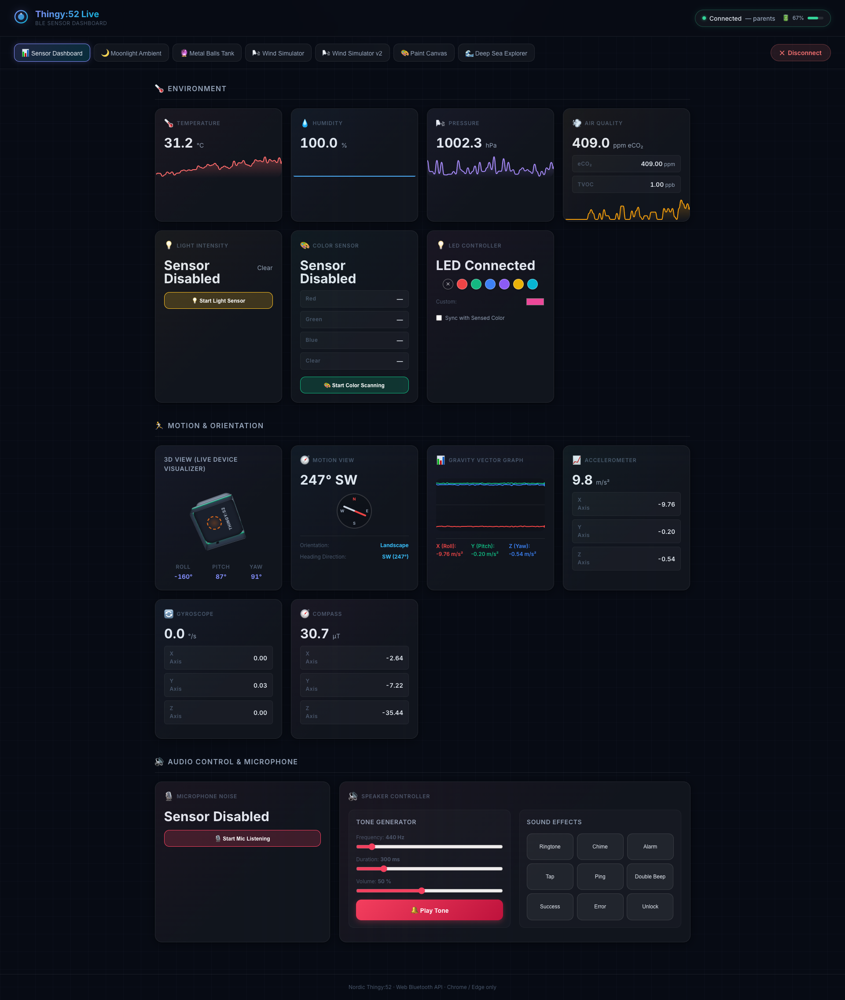
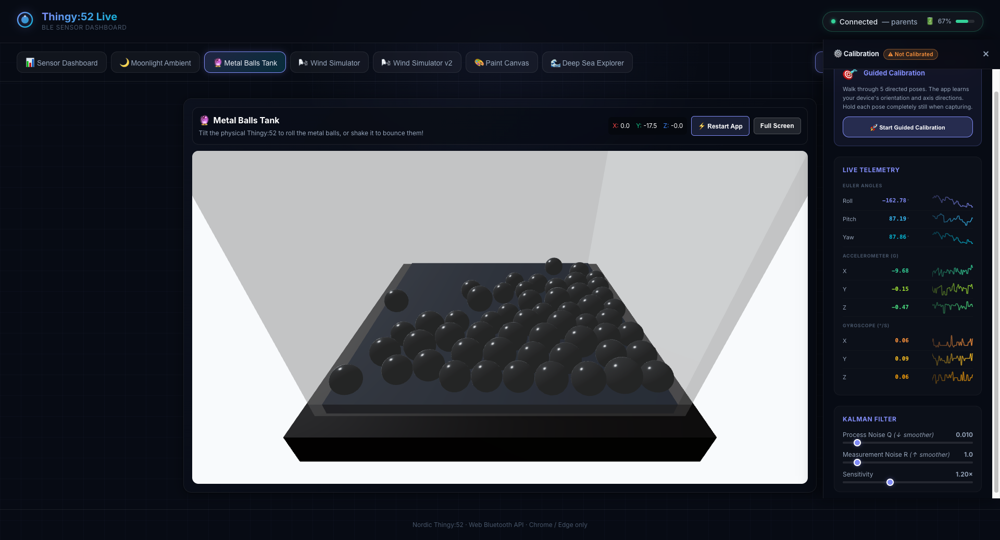

# Nordic Thingy:52 Live Dashboard & 3D Simulators

A state-of-the-art Web Bluetooth (BLE) dashboard and interactive 3D physics simulator suite for the **Nordic Thingy:52** multi-sensor prototyping platform. Built using React, Vite, and Three.js (React Three Fiber & Rapier Physics).

## 📸 Screenshots


*Figure 1: Main Dashboard showing real-time environment sensor readings (temperature, humidity, pressure, air quality eCO₂/TVOC), live signal charts, LED controls, and speaker tone controllers.*

<br/>


*Figure 2: Interactive 3D Simulators (Wind Simulator v2, Metal Balls physics tank, Paint Drip Canvas, and Moonlight Ambient view) driven in real-time by the Thingy:52's physical orientation, utilizing low-latency relative quaternion mapping.*

---

## 🚀 Key Features

- **Web Bluetooth BLE Core**: Low-latency GATT connection with MTU negotiation and sequential service hooks to prevent device congestion.
- **Environment Telemetry**: Live updates for Temperature, Humidity, Pressure, and eCO₂/TVOC. Includes on-demand color scanning synchronizable to the device's RGB LED.
- **Sound & Decibels**: Real-time microphone sound pressure level (SPL) graphing (with ADPCM audio packet decoding) alongside predefined tone/frequency generation.
- **Advanced 3D Motion Fusion**: 
  - **relative quaternion mapping**: Smooth orientation tracking using relative quaternions to completely avoid Gimbal Lock and axis crosstalk.
  - **Metal Balls Tank**: A physical simulation of 55 shiny metal spheres in a glass enclosure colliding in real-time under custom gravity.
  - **Coastal Wind Simulator**: Real-time wind gust simulation controlled by the orientation and CO₂ changes (breathe on the sensor!).
  - **Moonlight Ambient View**: A 3D dark bedroom scene featuring a swinging hanging lightbulb powered by Rapier joints and accelerometer inputs.
  - **Paint Drip Canvas**: Physics-based dripping canvas matching your physical tilts.
- **Kalman Filtering**: Integrated signal noise filtering for ultra-smooth rendering.

## 🛠️ Getting Started

### Prerequisites

- A **Nordic Thingy:52** device.
- A Web Bluetooth-compatible browser (e.g., Google Chrome, Microsoft Edge, Opera).

### Installation

1. Clone the repository:
   ```bash
   git clone https://github.com/parmarravi/NordicThingy52Discover.git
   cd NordicThingy52Discover
   ```

2. Install dependencies:
   ```bash
   npm install
   ```

3. Run the development server:
   ```bash
   npm run dev
   ```

4. Open `http://localhost:5173` in your browser, click **Connect Thingy:52**, and start exploring!

---

For a detailed breakdown of the internal architecture and Bluetooth service hooks, check out [HOW_IT_WORKS.md](./HOW_IT_WORKS.md).
